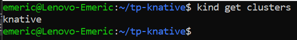
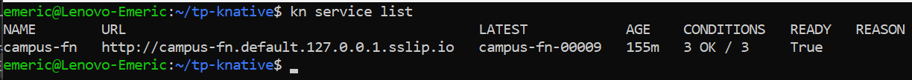
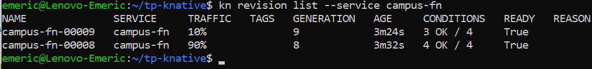
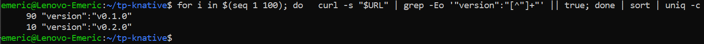
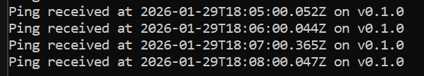

# TP-KNATIVE

Contributeur : SAUTHIER Emeric

## Résultat : kind get clusters

## Résultat : kn service list

## Résultat : kn revisions list --service campus-fn

## Preuve du split

## Logs prouvant PingSource => Broker => Trigger => Service
